# 🧴 Sephora Skincare Intelligence — EDA + Pinktuition AI

*Because your skincare deserves more than pretty packaging.*

Ever stood in a beauty aisle, squinting at a label that promises to "brighten, firm, and transform" — and wondered if any of it is actually true? This project finds out. We dig into thousands of Sephora products, cross-reference their marketing claims against their actual ingredient lists, and build an AI recommender that cuts through the noise and matches your skin to what will genuinely work.

---

## 📌 Project Overview

The beauty industry runs on claims — *brightening*, *anti-aging*, *barrier-repairing* — but how often do a product's actual ingredients back up what's on the label? This project investigates that question across thousands of Sephora products, then applies those same ingredient profiles to power a real-time, personalised skincare recommender.

The project has two interconnected parts:

| Part | What it does |
|---|---|
| **Part 1 :Google Colab EDA**  | Feature engineering, claim-ingredient alignment analysis, pricing analysis, sentiment analysis, Google Trends, and an ML recommender prototype |
| **Part 2 :Pinktuition AI** 🧴 | A deployed, interactive Streamlit recommender built on the features and TF-IDF model developed in Part 1 |

---

## 🗂️ Repository Structure

```
├── app.py                            # Pinktuition AI — Streamlit app
├── skincare_sephora.ipynb            # Google Colab notebook (EDA + ML)
├── README.md
│
├── data/
│   ├── sephora_cleaned.xlsx          # Raw cleaned dataset (input to Colab)
│   ├── sephora_final.csv             # Feature-engineered dataset (EDA output → app input)
│   ├── sephora_reviews.csv           # Merged reviews dataset
│   ├── sephora_reviews_cleaned.csv   # Cleaned reviews with sentiment labels
│   ├── ingredients_trends.csv        # Google Trends data for key ingredients
│   ├── reviews_3.csv                 # Raw reviews — rating band 3
│   ├── reviews_4.csv                 # Raw reviews — rating band 4
│   └── reviews_5.csv                 # Raw reviews — rating band 5
│
└── charts/
    ├── ing_vs_mc_freq.png
    ├── price_vs_ingredient.png
    ├── price_vs_no_of_ingredient.png
    ├── price_vs_mc.png
    ├── price_vs_no_of_mc.png
    ├── loves_per_ingredient.png
    ├── ingredients_rating.png
    ├── ingredients_trends.png
    ├── avg_pop.png
    ├── growth_rate.png
    ├── category_trends.png
    ├── sentiment_dist.png
    ├── word_freq.png
    ├── word_cloud.png
    ├── review_len_vs_sent.png
    └── recommendation_rate.png
```

> **Note:** Update file paths in `app.py` and the Colab notebook to `data/sephora_final.csv` and `data/sephora_reviews.csv` after reorganising into this structure.

---

## Part 1 — EDA & Feature Engineering (Google Colab) 

### 1. Hero Ingredient Flag Creation

Not all ingredients are created equal. We zeroed in on 9 clinically recognised hero ingredients and built binary flags for each by scanning every product's full ingredient list using regex — no greenwashing gets past us:

- Niacinamide
- Retinol / Retinoids (retinal, retinyl, retinoid)
- Hyaluronic Acid / Sodium Hyaluronate
- Vitamin C (ascorbic acid, ascorbyl derivatives, tetrahexyldecyl ascorbate)
- Salicylic Acid
- Ceramides
- Peptides (palmitoyl, tripeptide, hexapeptide)
- Glycolic Acid
- Kojic Acid

A composite `hero_ingredient_count` column captures how many hero ingredients each product contains.

### 2. Marketing Claim Flag Creation

Seven marketing claim categories were extracted from the product highlights column using keyword matching — because if a brand says it, we're holding them to it:

| Claim | Example keywords |
|---|---|
| Hydrating | hydrating, moisturizing, nourishing, dry skin |
| Anti-Aging | anti-aging, wrinkle, fine lines, youthful |
| Brightening | brightening, glow, radiance, dullness |
| Acne Care | acne, blemish, oil control, pore care |
| Sensitive Skin | gentle, barrier, soothing, calming |
| Firming | firming, lifting, tightening |
| Free-From / Clean | fragrance free, vegan, cruelty-free, clean |

### 3. 🫧 Claim–Ingredient Alignment Analysis

The core question driving this entire project: **do products that make a specific marketing claim actually contain the ingredients that support it?**

Four claim categories were put to the test against their corresponding hero ingredients:

| Claim | Hero Ingredients Checked |
|---|---|
| Brightening | Vitamin C, Kojic Acid, Glycolic Acid |
| Anti-Aging | Retinol, Peptides |
| Hydrating | Hyaluronic Acid, Ceramides |
| Acne Care | Salicylic Acid, Niacinamide |

For each claim, the **alignment rate** — the percentage of products making that claim that actually contain a relevant ingredient — was calculated. The results are more revealing than most brands would like.

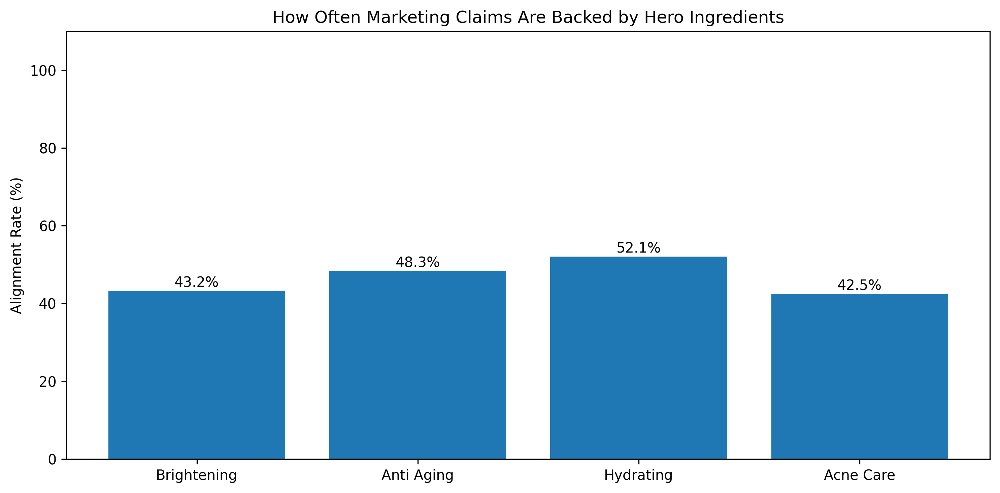

### 4. Pricing Analysis

Does a higher price tag mean a better formula? We put that to the test too.

**Average price by hero ingredient** — which ingredients are associated with premium pricing?

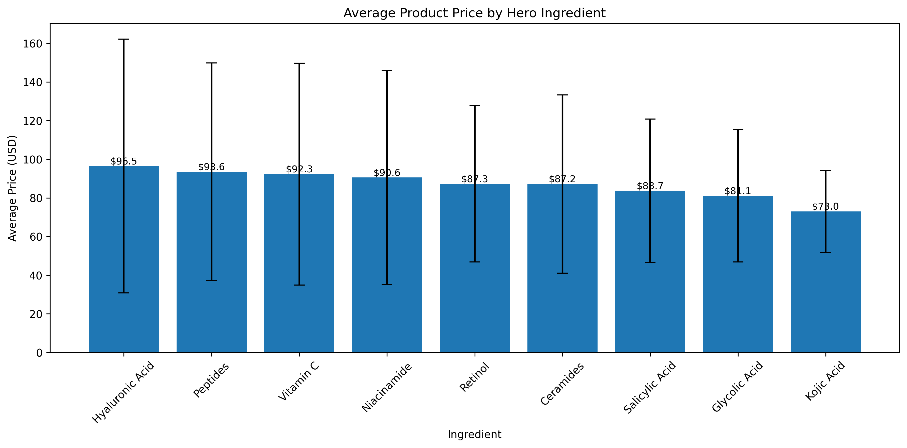

**Price vs hero ingredient count** — does formulation complexity actually cost more?

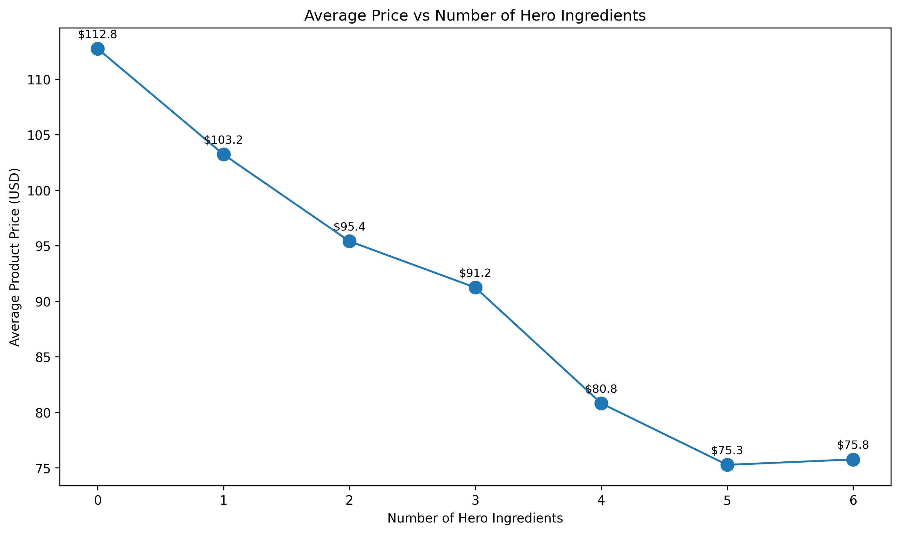

**Average price by marketing claim** — which claims command the biggest price premium?

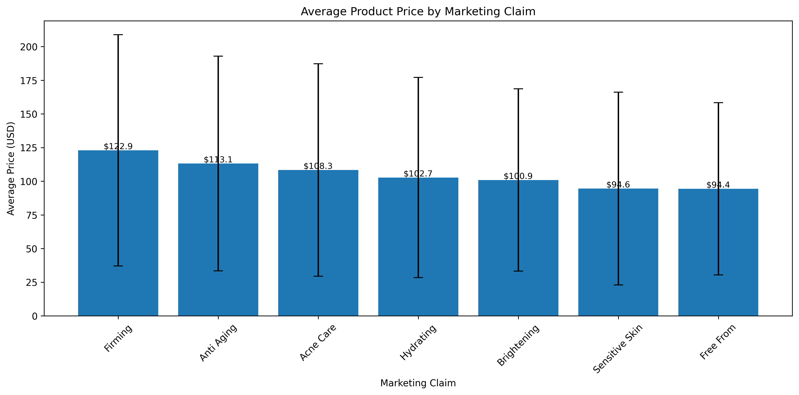

**Price vs marketing claim count** — more claims, more money?

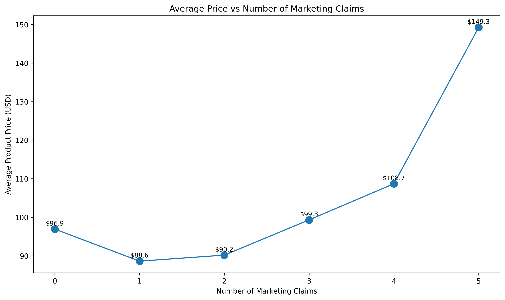

### 5. Consumer Popularity & Ratings

We let the shoppers speak. Which ingredients are people actually reaching for — and loving?

**Average Sephora loves count by hero ingredient:**

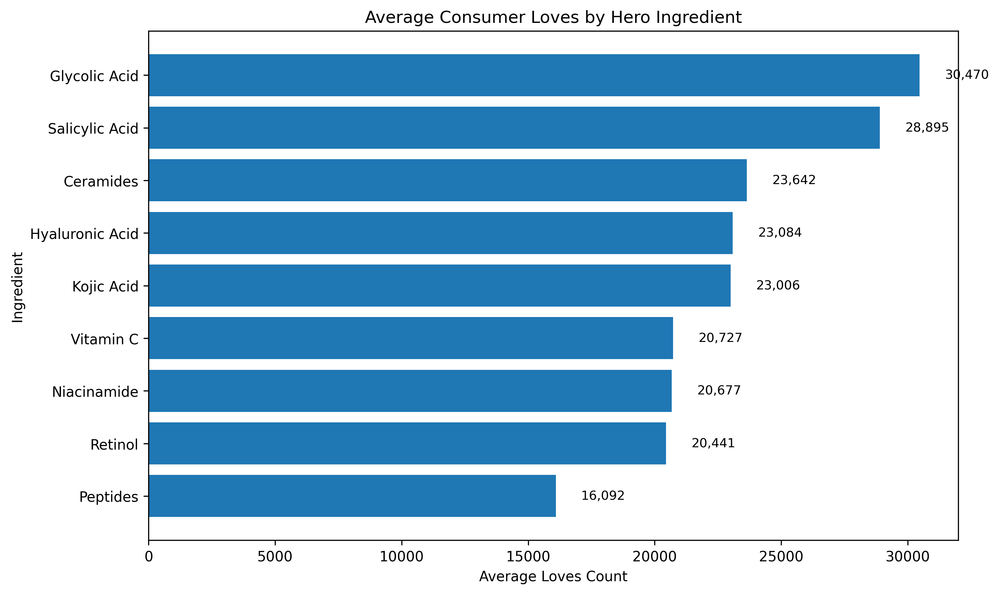

**Average star rating by hero ingredient:**

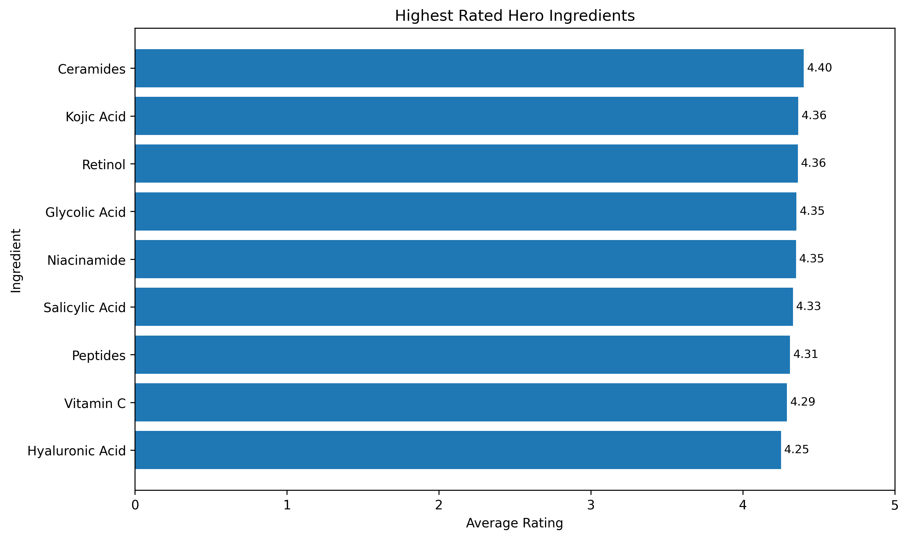

### 6. Sentiment Analysis (TextBlob + NLTK) 🌸

Thousands of real customer reviews, put through the wringer:

- Advanced text cleaning: lowercasing, removing punctuation, numbers, apostrophes, and skincare-specific stopwords
- Sentiment polarity scored via **TextBlob**, labelled Positive / Neutral / Negative

**How do Sephora shoppers really feel?**

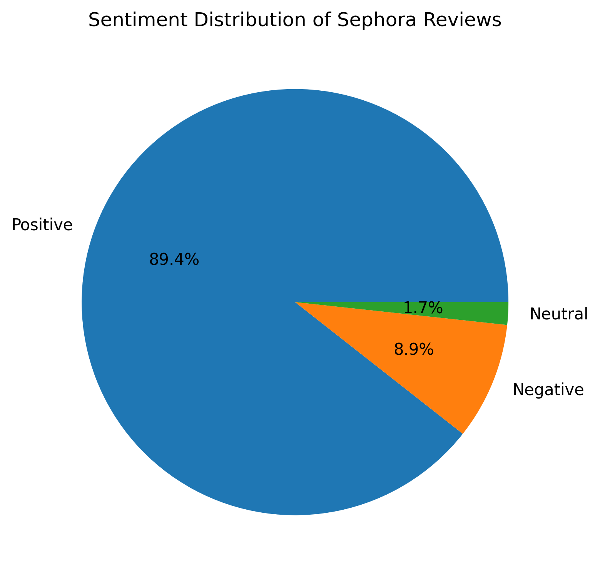

**The words that keep showing up:**

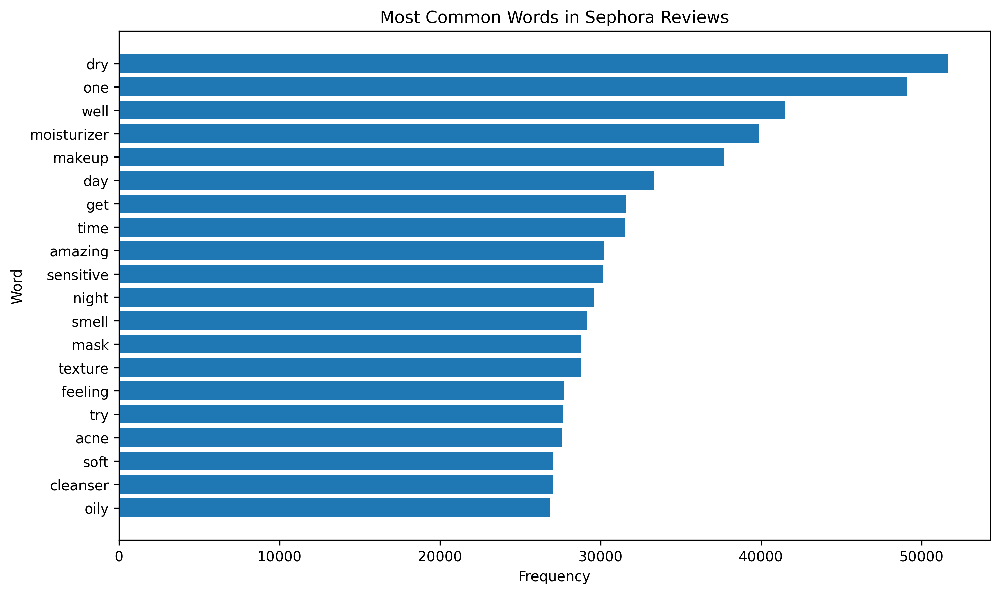

**What people gush about vs. what they complain about:**

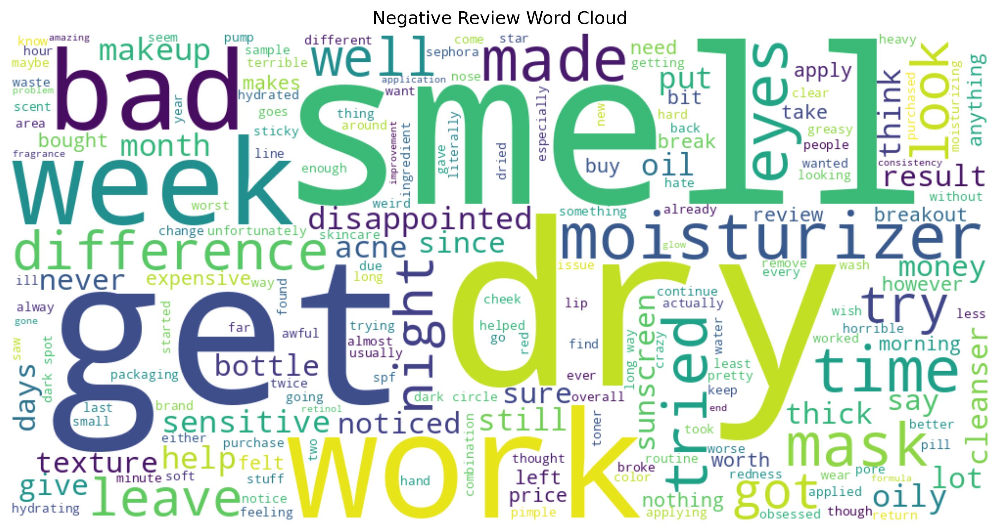

**Do unhappy reviewers write more? (Spoiler: yes.)**

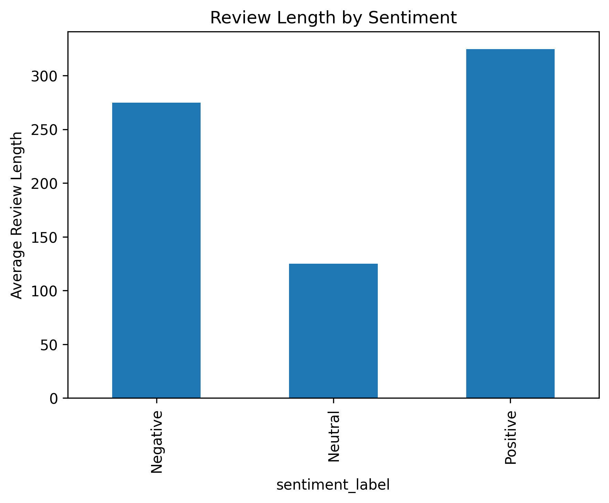

**Overall recommendation rate:**

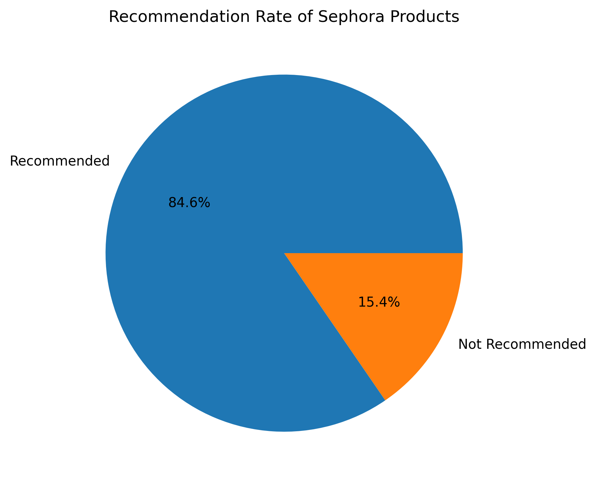

### 7. Google Trends Analysis 🫧

Ingredient trends aren't just about what works — they're about what's *having a moment*. We pulled Google Trends data to see which ingredients are rising, which are peaking, and which are already on their way out.

**Search interest over time:**

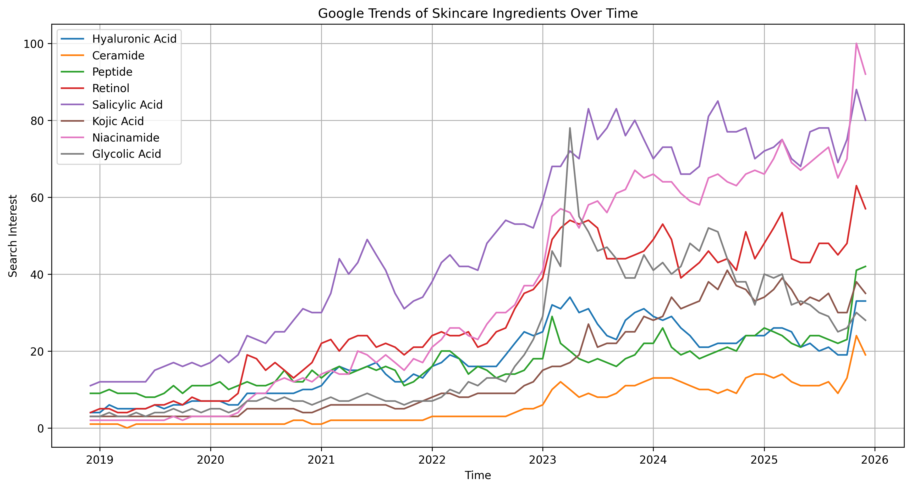

**Average popularity ranking across the full time window:**

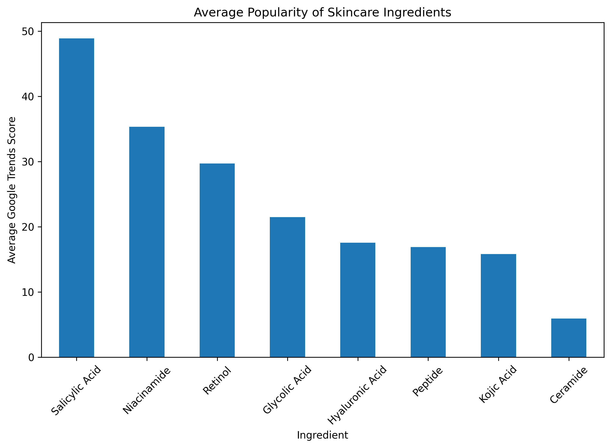

**Growth rate (%) per ingredient — the real rising stars:**


**Category-level trends — Hydration & Barrier, Acne & Oil Control, Anti-Aging, Brightening:**

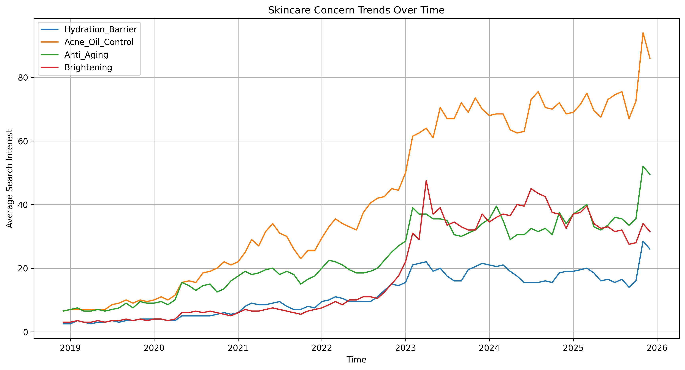

### 8. Machine Learning — TF-IDF Recommender Prototype 🧴

This is where the EDA becomes something you can actually use. The Colab notebook contains the full prototype of the recommender engine that powers Pinktuition AI:

- Five **concern profiles** (brightening, anti-aging, hydrating, acne care, sensitive skin) are defined as curated ingredient strings
- All product ingredient lists are vectorised using **TF-IDF** (unigrams to trigrams, `min_df=2`, `max_df=0.95`)
- **Cosine similarity** is computed between each concern vector and all product vectors
- A combined score blending cosine similarity (70%) and normalised rating (30%) is used to rank results
- Horizontal bar charts visualise the top 5 products per concern

---

## Part 2 — 🧴🫧 Pinktuition AI (Streamlit App)

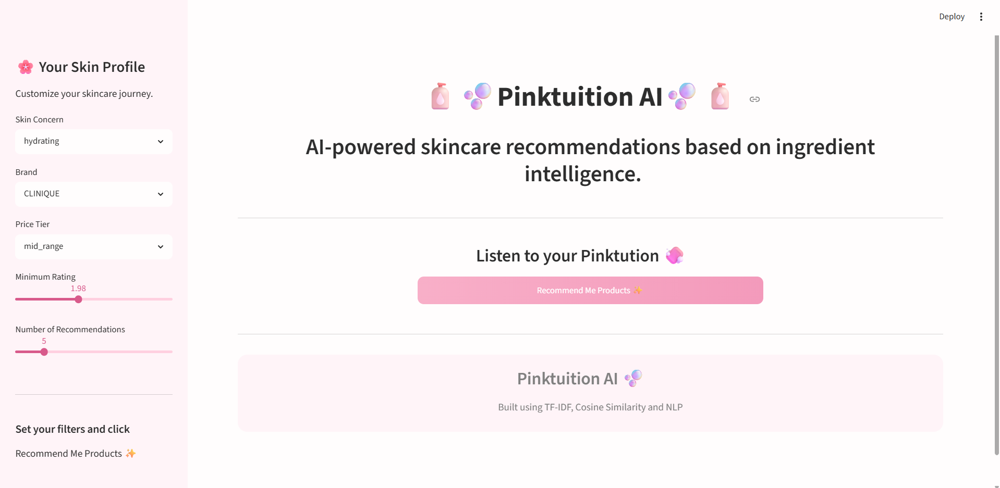

*Listen to your Pinktuition.*

### How the two parts connect

The Colab notebook is the **data and model layer**. It produces `sephora_final.csv` — the feature-enriched dataset that Pinktuition loads directly. The same TF-IDF vectoriser and concern profiles designed in the notebook are re-implemented in the app, so the recommender logic is identical; Pinktuition just puts a beautiful, interactive face on it.

```
Colab EDA
  └─ feature engineering → data/sephora_final.csv
  └─ TF-IDF prototype → concern profiles & scoring logic
           ↓
Pinktuition AI (app.py)
  └─ loads data/sephora_final.csv
  └─ re-implements TF-IDF + cosine similarity
  └─ exposes filters, results, and customer reviews interactively
```

### App Features

**🌸 Sidebar — Your Skin Profile**
- Skin concern: Brightening / Anti-Aging / Hydrating / Acne Care / Sensitive Skin
- Brand filter (All or specific brand)
- Price tier: Cheap (< $30) / Mid-Range ($30–$80) / Expensive (> $80)
- Minimum star rating (0–5)
- Number of recommendations (3–15)

**🧴 Main Results Panel**
- Each recommendation card displays: product name, brand, price tier, rating, price, and a **match score** (colour-coded green / amber / red)
- **Matching ingredients** — highlights which hero ingredients from the concern profile the product actually contains, directly surfacing the EDA's alignment analysis in the UI
- **Customer reviews** pulled from `sephora_reviews.csv` with sentiment-based colour coding (green = 4+, amber = 3–4, red = below 3)

**🫧 Insights Panel**
- Summary metrics: best match score, average rating, average price, total products found
- Bar chart of recommendation scores
- CSV download of results

---

## 🛠️ Tech Stack

| Layer | Tools |
|---|---|
| Data wrangling | pandas |
| NLP / ML | scikit-learn (TF-IDF, cosine similarity), TextBlob, NLTK |
| Visualisation | matplotlib, seaborn, wordcloud |
| Trend data | Google Trends |
| App framework | Streamlit |
| Environment | Google Colab (EDA), local / cloud (app) |

---

## Running Pinktuition Locally

```bash
pip install streamlit pandas scikit-learn textblob nltk wordcloud seaborn

streamlit run app.py
```

Ensure `data/sephora_final.csv` and `data/sephora_reviews.csv` are in place before running.

---

## 📁 Data Sources

- **Sephora Products Dataset** — product metadata, ingredient lists, ratings, loves count, and highlights (sourced from Kaggle)
- **Sephora Reviews Dataset** — customer review text across rating bands 3, 4, and 5
- **Google Trends** — weekly search interest for key skincare ingredients

---
built by Meher Vaswani | Data Scientist
